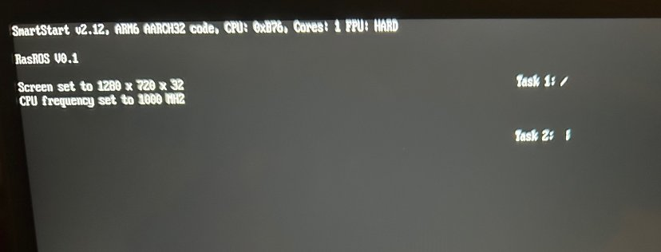

# RasROS: Bare Metal FreeRTOS Implementation for Raspberry Pi Zero

This C project (RASpberry Real-time Operating System) is if you just want to run a single application on the RPi Zero that accesses the GPIO pins, SPI/I2C/UART serial devices, and/or draws text and basic 2D graphics to the HDMI display without all the overhead of running a full OS. It implements the industry-standard FreeRTOS open-source library to manage real-time task switching and task management, or you can simply not include it and run your own single-threaded code with full kernel-level control over the system.

The main loop of this "Hello World" example code launches two simple tasks (threads) that each animate a rotating character on different parts of the screen and run indefinitely. You can use it as a base to add your own project's code that launches simultaneous tasks in a similar way, or otherwise executes from the starting function kernel_main() in kernel.c.

The limitation of this project is that some of the on-board RPi hardware devices (peripherals) are proprietary, so there is little to no public documentation available to be able to write drivers for them. Therefore there's no code included to access the on-board WiFi/Ethernet, USB, accelerated graphics, or SD card (other than initial loading of the kernel). However, there are library functions to create text and 2D graphics on the HDMI output (via drawing to the hardware framebuffer), input and output on GPIO pins, and support for I2C, SPI and UART serial communication.

## Why Bare Metal Raspberry Pi Zero?

Good question. Probably the best use case is if you need a super-inexpensive way to draw text and basic 2D graphics to an HDMI display instead of a small LCD display like most other embedded devices use, while retaining full control over the system and having a real-time response to I/O events and task switching. Otherwise, you might be better off with the plenty of other inexpensive bare metal embedded devices like ESP32 and STM32 boards that come fully documented, with plenty of CPU power, memory, GPIO pins, networking, USB and other peripherals, all with full driver libraries and sample code.

However if you still want to develop for the Pi Zero, this project can provide a base to start with.

## Can this work with Pi Zero 2 and other Pi models?

It could, with basic modifications. It's based on a collection of open-source code from the [Circle Project](https://github.com/rsta2/circle) and [Leon de Boers](https://github.com/LdB-ECM/Raspberry-Pi)' bare-metal RPi libraries that were simplified here to only cover the Pi Zero, but were originally designed for multiple RPi models.

## Why and what is FreeRTOS?

FreeRTOS is a well-established, robust, proven, open-source multi-task scheduler and manager used widely in embedded and real-time systems, currently owned and maintained by Amazon. It's used for this project because if you need bare metal performance, you probably also need quick, guaranteed timely response to I/O events and multiple task execution which FreeRTOS can provide.

(If you're just here to see how to implement FreeRTOS into your own RPi project, you're probably looking for the files port.c, portmacro.h, and freeRTOSConfig.h which contain RPi Zero specific functionality that FreeRTOS is expecting to find. Also see Interrupts.c for one way to implement the main FreeRTOS tick update in ARMTimerHandler(). This project uses the RPi Zero's only hardware timer to run FreeRTOS, called in that interrupt handler. It sets up the interrupt in port.c xPortStartScheduler(). Then portYIELD in portmacro.h is implemented by throwing an ARM software interrupt, whose handler swiHandler() in interrupts.c calls vTaskSwitchContext. Also see kernel_main() in kernel.c to see how it registers the FreeRTOS sample tasks then turns over control to FreeRTOS with vTaskStartScheduler()).

## Compiling and Executing on RPi Zero Hardware

1\. This project was developed on a Windows system using Microsoft Visual Studio free Community edition, with SysProg's Visual GDB extension installed. That provides an easy way to cross-compile within the IDE to other chipsets using the GCC compiler. There are Visual Studio project files and Visual GDB setting files included in this repository you can use to edit and hopefully easily compile and link. Output after building the project will be to the file "RasROS.bin."  
 You can also compile the project with Linux or Mac OS using command line GCC with the ARMv6 toolchain (arm-none-eabi). Within the FreeRTOS library only compile heap_4.c out of the heap file options. Use these command line flags:

\-fsigned-char -ffreestanding -nostartfiles -std=c99 -Os  
\-march=armv6k -mtune=arm1176jzf-s -marm -mfpu=vfp -mfloat  
\-abi=hard

2\. Output in either case will be a .bin file (e.g. RasROS.bin) which you then need to convert to an img file (kernel.img) in a post-build step using the objcopy utility file that's part of the arm-non-eabi\\bin toolchain:

objcopy.exe -I binary RasROS.bin -O binary kernel.img

3\. Insert a bootable SD card from your RPi Zero into an SD card reader on your development system. It should show up as two partitions/drives, one called "recovery" and one called "boot." You'll need to copy kernel.img from step two into the "boot" directory (though first save the original kernel.img in case you want to restore it later). This is the file the RPi Zero will look for and load at startup.

Note the RPi boot process starts with on-board firmware loading additional firmware (binary blobs) off the SD card which is why you need all the other files from an original bootable SD card. The firmware executes startup and initialization code in the video GPU (which shows a color pattern and the Raspberry Pi logo on the display) before loading your "kernel.img" executable into the main CPU, where it starts execution at address 0x8000.

This base project prints out some basic debug information (which can be changed, just search through the source code) then launches two sample tasks which animate a couple ascii characters indefinitely. Simply turn off the Pi to stop. (There is no SD card access so powering down suddenly won't corrupt it).

## RasROS Architecture and File Description

Execution of kernel.img begins (per linker.ld) at the \_start label which is in SmartStart32.S. This sets up the ARM CPU, interrupt table, and contains some utility functions and variable definitions used by some of the libraries. It then jumps to kernel_main defined in kernel.c.

Kernel_main first initializes the screen and graphics library, as well as a printf implementation. (Note this is a freestanding executable so there is no C runtime or library functions like malloc and free, though SmartStart32.S does zero out static variables. See programming notes below).

Next it registers two example task functions for FreeRTOS to execute, then turns over execution to FreeRTOS with vTaskStartScheduler(). If you don't want to use FreeRTOS, just want to run in raw single-threaded kernel execution mode, simply delete those lines and execution continues with whatever code you add. Note that bare-metal code should never return from kernel_main because there's nothing to return to (the startup code will just infinitely loop by default).

Other files in this repository are optional but useful libraries that have been integrated into this project:

**SmartGraph.c** - Graphics library functions to draw text (a basic bitmap font is included in Font8x16.h), lines, shapes and bitmaps using a "device context" and "handle" concept similar to legacy Windows' GDI graphics library.

**MemMapIO.c** - Utility functions to access Pi Zero memory-mapped hardware registers to control things like display setup, timers, GPIO pins, interrupts, and hardware UART controller. See [BCM2835 Pi Zero hardware documentation](https://www.raspberrypi.com/documentation/computers/processors.html).

**Emb-stdio.c -** an implementation of printf functions using the above graphics library

**Interrupts.c** - Basic interrupt handler functions declared in interrupt tables set up in SmartStart32.S. RasROS only uses the hardware timer interrupt to drive FreeRTOS, though there are some shell handlers for GPIO interrupts that weren't fully implemented (one common use might be to have FreeRTOS immediately switch to the appropriate handling task on a GPIO interrupt for a real-time response)

## Programming Notes

- There is no malloc() or free() function implemented, as real-time and embedded system modules more typically use static char arrays for dynamic storage and each manage that memory themselves. However if you want to implement a system-wide heap, the address of the start of free memory begins at the global variable \_end (defined in linker.ld to be the end of the code and data sections) and runs up to the end of RAM (512MB on the Pi Zero). See BCM2835 documentation for other memory addresses since most of the I/O and peripheral registers are memory-mapped to addresses above that.  

- If you're new to [FreeRTOS](https://freertos.org/Documentation/00-Overview), the overall idea is that you have multiple "tasks" (C functions) that are all started at initialization and each run forever in their own infinite loops. The example tasks in kernel_main() are set to run at the same priority, so under FreeRTOS they get time-sliced evenly for execution. You can however set different priorities to tasks, and set a pre-emptive option (on by default, see freeRTOSConfig.h) so if a high priority interrupt needs immediate handling, for example, its handler task can be given full CPU until it has decided it is finished and yields. All those options are described in the documentation link above, but if you don't care and just want to split task execution evenly, you can do everything like the xTaskCreate examples in kernel_main.  

- The FreeRTOS subdirectory is exactly as downloaded from freertos.org, so updating to a newer version "should" just be a matter of copying in the new files. However back up the folder before attempting, of course. 

- There aren't SD card file functions in this project, so if you have run-time data like bitmaps you want to display, you'll need to encode it as static array data (see Font8x16.h for an example). Or if your compiler supports the C23 standard, you can use #embed to include a file at compile time, e.g. static const unsigned char bitmap_data[] = {
    #embed "Bitmap.bmp"
};
